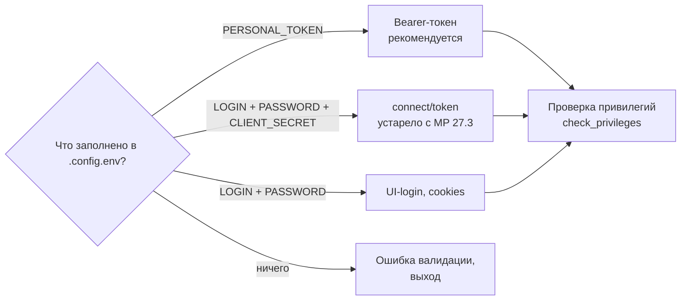
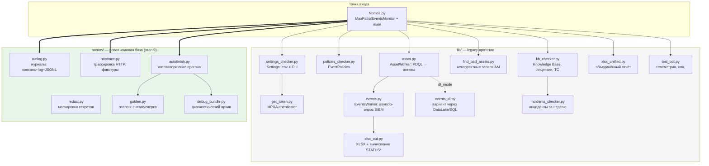
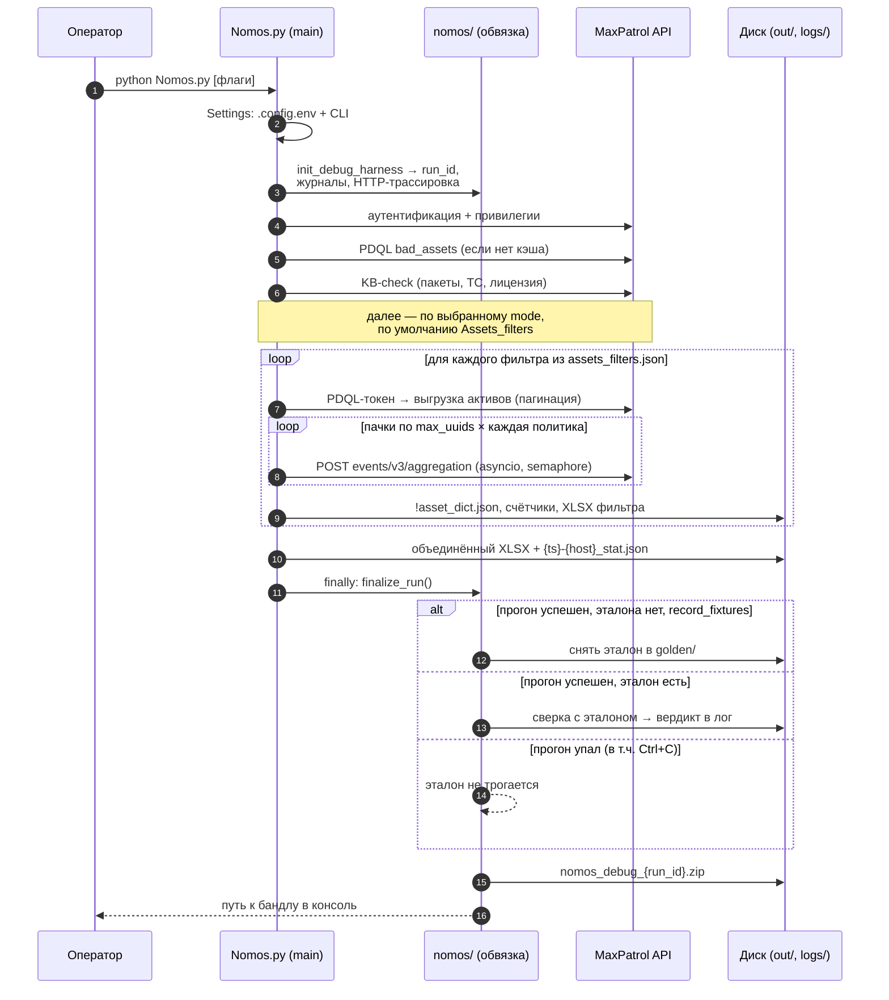
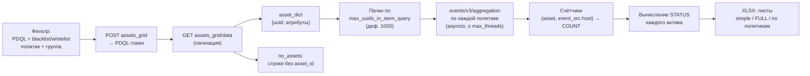
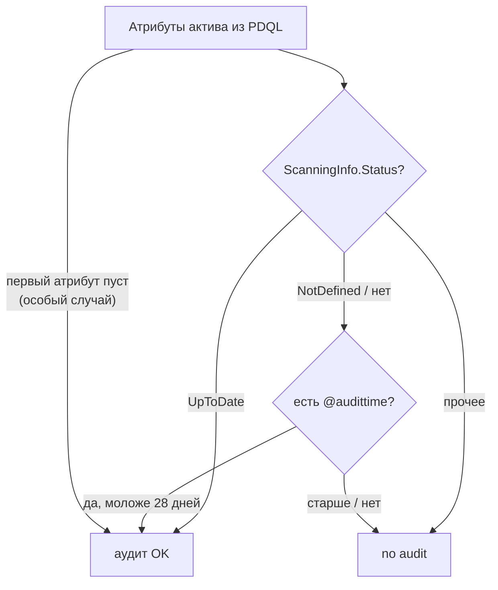
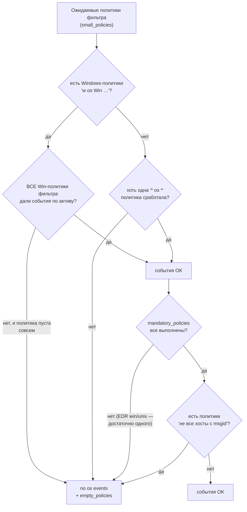
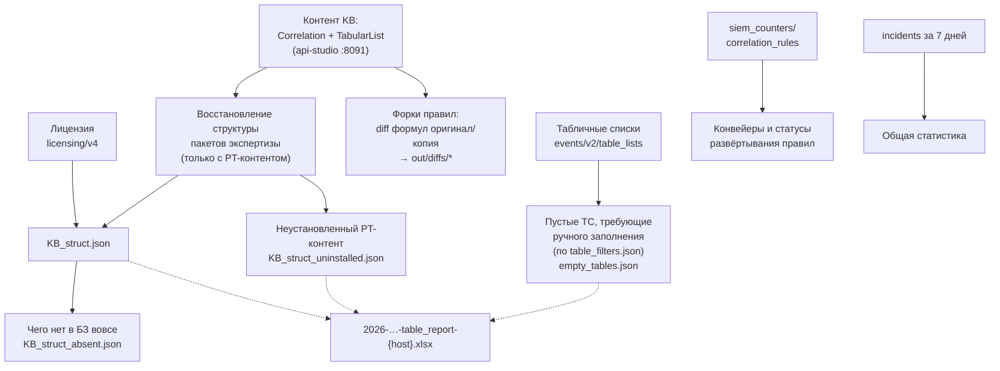
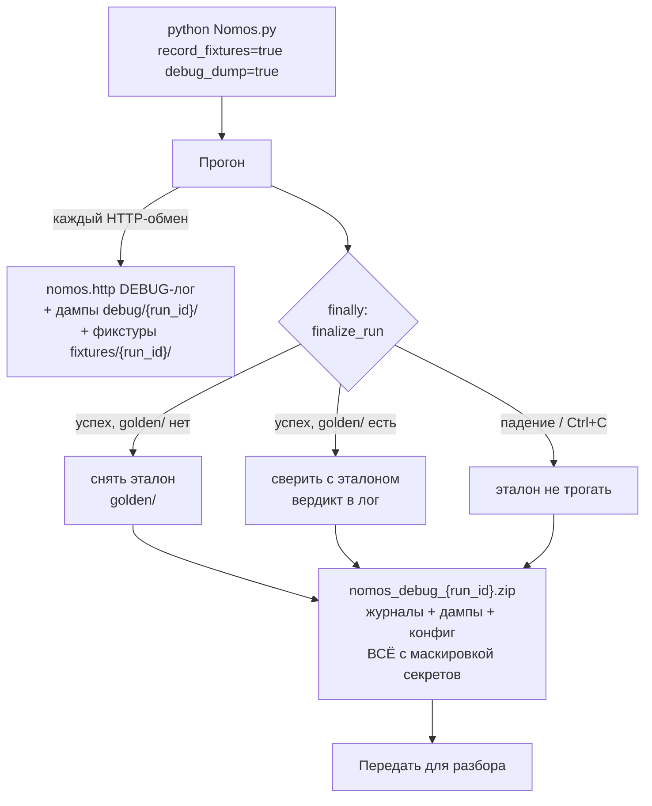

# Nomos

**Аудитор покрытия SIEM MaxPatrol 10.** Отвечает на вопрос: *насколько полно активы
инфраструктуры покрыты сбором событий и экспертизой (правилами корреляции)?*

Nomos выбирает активы из Asset Management PDQL-запросами, опрашивает SIEM по
десяткам «политик событий», сопоставляет наличие событий с каждым активом,
вычисляет статус покрытия (`ok` / `no audit` / `no os events` …), анализирует
установленность пакетов экспертизы Knowledge Base и заполненность табличных
списков — и собирает всё в отчёты.

> Проект рефакторится из CLI-прототипа в веб-приложение. Текущее состояние:
> **веб-MVP работает** — запуск прогонов и просмотр результатов в браузере,
> XLSX доступен по кнопке.

---

## Содержание

1. [Быстрый старт](#быстрый-старт)
2. [Архитектура](#архитектура)
3. [Полный цикл прогона](#полный-цикл-прогона)
4. [Режимы работы](#режимы-работы)
5. [Логика вычисления STATUS](#логика-вычисления-status)
6. [Проверка Knowledge Base](#проверка-knowledge-base)
7. [Конфигурационные файлы](#конфигурационные-файлы)
8. [Результаты прогона](#результаты-прогона)
9. [API MaxPatrol, которые использует Nomos](#api-maxpatrol)
10. [Отладочная обвязка](#отладочная-обвязка)
11. [Структура репозитория](#структура-репозитория)

---

## Требования

**Python 3.10 и новее.** Верхней границы нет: Nomos запускают тем
интерпретатором, который уже стоит у заказчика. Проверены 3.10, 3.12 и
3.14 — на всех проходит полный набор тестов.

На версиях новее проверенных программа предупредит, но запустится.
Единственный реальный риск там — сторонние пакеты: у pydantic-core
может ещё не быть готовых колёс, тогда установка падает. Проверено на
Python 3.15 alpha: установка не проходит, и Nomos объясняет, что делать,
вместо трейсбека из недр pydantic.

Установка на машине, где Python ещё не ставили (Windows):

```powershell
# 1. python.org -> Python 3.12 или 3.13 (64-bit), при установке отметить
#    "Add python.exe to PATH"
py -0p                                   # какие версии уже есть

# 2. Зависимости ставить ЭТИМ интерпретатором, а не первым попавшимся
py -3.12 -m pip install -r requirements.txt

# 3. Запускать им же
py -3.12 Nomos.py
```

Частые грабли на чистой машине:

| Что видно | Причина | Что делать |
|---|---|---|
| `"pip" не является внутренней или внешней командой` | pip не в PATH | вызывать через интерпретатор: `py -3.12 -m pip ...` |
| `No module named 'pip._vendor.urllib3.packages.six.moves'` | битый pip в этой установке Python | `py -3.12 -m ensurepip --upgrade`, затем `py -3.12 -m pip install --upgrade pip`; если не помогло — переустановить Python |
| `DLL load failed while importing _pydantic_core` | пакеты встали в другой Python, либо ставился старый pydantic без колёс под вашу версию | повторить установку **тем же** интерпретатором и не фиксировать версии пакетов вручную |
| `ModuleNotFoundError` на любом пакете | зависимости ушли в другой интерпретатор | Nomos сам подскажет точную команду с нужным путём |
| `python` открывает Microsoft Store | системный алиас Windows | Параметры → Приложения → Псевдонимы выполнения → выключить `python.exe`, либо всегда использовать `py -3.12` |

Если ставить Python на машину нельзя вовсе — собирается версия в один
файл, которой интерпретатор не нужен: [docs/BUILD_EXE.md](docs/BUILD_EXE.md).

## Быстрый старт

**Веб-версия** (основной способ):

```bash
pip install -e ".[dev]"
cp configs/example.config.env configs/.config.env    # заполнить HOST и токен
python nomos_web.py                                  # http://127.0.0.1:8137
```

В браузере: «Подключение» → проверить доступ к MaxPatrol; «Новый запуск» →
параметры и старт; прогресс — на месте (поллинг); «Результаты» — таблицы
Активы / События без актива / Некорректные / Коллизии / Фильтры / Экспертиза
с поиском, фильтрами и серверной пагинацией; XLSX и диагностический бандл —
по кнопкам. История прогонов хранится в SQLite (`nomos.db`), каждый прогон —
в своей папке `out/web-<ts>/`.

**CLI** (сохранён полностью):

```bash
python Nomos.py                                      # обычный прогон
python Nomos.py record_fixtures=true debug_dump=true # прогон с отладкой/эталоном
```

Аутентификация — любой из трёх способов (приоритет сверху вниз):



## Архитектура

Слои текущей кодовой базы. Серым — legacy-прототип (`lib/`), который поэтапно
переезжает в пакет `nomos/`; зелёным — уже новая кодовая база.



\* Известный архитектурный долг: вычисление STATUS живёт внутри модуля
генерации Excel (`xlsx_out.py`). Его переезд в доменный слой — этап 1 плана.

## Полный цикл прогона



## Режимы работы

Задаются параметром `mode` (env/CLI). Дефолт — `Assets_filters`.

| Режим | Источник целей | Что делает | Выход |
|---|---|---|---|
| `Assets_filters` | 47 фильтров из `assets_filters.json` | Полный аудит: активы каждого фильтра + события по политикам фильтра | XLSX на фильтр + объединённый отчёт |
| `ALL_events` | группа `mpx_group` | Только события, без выборки активов | один XLSX |
| `ALL_assets` | дефолтный PDQL | Все активы + события | один XLSX |
| `Dynamic_Groups_assets` / `_events` | UUID из `dynamic_groups.txt` | То же по динамическим группам (с проверкой существования) | XLSX + `group_info.json` |
| `Asset_IDs` | UUID из `asset_ids.txt` | События по конкретным активам | один XLSX |
| `Only_KB` | — | Объявлен, но в main закомментирован (мёртвый режим) | — |

Конвейер режима `Assets_filters` для одного фильтра:



Особые механики:
- **fallback_search_field** — если у актива есть альтернативный идентификатор
  (например, hostname), делается второй проход поиска событий по нему;
- **audit_hack** — при включённом `siem_scans.py` на стенде добавляется
  синтетическая политика «Audit Events Hack» с окном 700 часов;
- **clear_mode** — политика очистки `out/`: `full` (дефолт) чистит всё;
  `not_clear` пропускает фильтры с готовыми результатами (примитивное
  возобновление); `1/2/3-day` сохраняют свежие отчёты.

## Логика вычисления STATUS

Сердце продукта — функция `_status_master` (пока в `lib/xlsx_out.py`).
Для каждого актива по двум осям:

**Ось 1 — аудит актива свежий?** (`simple_audit_st`)



**Ось 2 — ОС-события приходят?** (`simple_pol_st_os`)



**Итоговый STATUS:**

| аудит | события | STATUS |
|---|---|---|
| ✓ | ✓ | `ok` |
| ✗ | ✓ | `no audit` |
| ✓ | ✗ | `no os events` |
| ✗ | ✗ | `no audit, no os events` |
| < 9 атрибутов в PDQL | — | `not 8` (некорректный PDQL фильтра) |

При слиянии в объединённый отчёт (`asset_analyzer` в `Nomos.py`) статусы
разных фильтров для одного актива комбинируются: `ok` уступает любому
проблемному статусу; `no audit` + `no os events` из разных фильтров
складываются. Дополнительно детектируются **коллизии**: один
`event_src.host` виден у нескольких asset_id.

## Проверка Knowledge Base

Включается флагом `kb_check_mode` (по умолчанию — да). `KB_Checker.work()`:



Связь «правило → нужные ему табличные списки» берётся из `table_mapping.json`,
маппинг ТС на asset-grid — зашит в `kb_checker.work()` (`List_Servers →
AssetGrid_Servers` и т.д.), сабрулы — из `subrules.json`.

Не всякий пустой список — недоработка. Требование «is empty and needs
fill» не выставляется для двух групп (`nomos/tablelists.py`):

* **общие списки исключений** — `Common_blacklist_value`,
  `Common_blacklist_regex`, `Common_IP_Subnet_Whitelist`,
  `Common_whitelist_*`. Пустой такой список означает «исключений нет»;
* **списки, заменённые asset-grid** — данные ведутся в Asset Management,
  руками их не заполняют.

## Отсутствие контента в базе знаний

Проверка Knowledge Base различает два случая, которые раньше выглядели
одинаково («не установлено»):

| Статус | Что значит | Что делать |
|---|---|---|
| не установлено | контент есть в базе знаний стенда, но не развёрнут | установить |
| **ОТСУТСТВУЕТ В БАЗЕ ЗНАНИЙ** | контента нет вовсе: не поставлен, нет лицензии на пакет, старая версия экспертизы | запросить поставку экспертизы |

Отсутствующее собирается в `out/<прогон>/KB_struct_absent.json`
(пакеты, правила корреляции, табличные списки), подсвечивается
оранжевым в листах политик XLSX и показывается на вкладке «Экспертиза»
отдельным блоком.

## Консольная поставка (без веба)

Для обратной совместимости и стендов, где веб не нужен, собирается срез
без веб-интерфейса — только `python Nomos.py` и xlsx-отчёты:

```bash
python tools/make_cli_dist.py            # dist/Nomos_cli.zip
python tools/make_cli_dist.py --keep-fixtures
```

Это не форк: те же файлы доменной логики, конфигов и отладочной
обвязки, из которых исключено всё, что нужно только вебу (FastAPI,
uvicorn, хранилище прогонов, статика). Зависимостей меньше, тесты веба
в набор не входят, остальные — те же. Сборщик прогоняет тесты внутри
готового среза и падает, если срез нерабочий.

## Единый exe

Для запуска на машине без Python собирается один файл. Веб-версия:

```powershell
powershell -ExecutionPolicy Bypass -File build_exe.ps1
```

Консольная — одной командой, сразу готовым архивом (скрипт сам заведёт
`.venv`, поставит зависимости и PyInstaller):

```powershell
powershell -ExecutionPolicy Bypass -File build_cli.ps1   # или ./build_cli.sh
```

В архиве `NomosCLI.exe` и папка `configs\` рядом с ним; остаётся
заполнить `.config.env` из шаблона. Порядок действий и разбор типичных
сбоев — в [docs/BUILD_EXE.md](docs/BUILD_EXE.md).

## Конфигурационные файлы

| Файл | Что содержит |
|---|---|
| `configs/.config.env` | Секреты и параметры (не в git). Шаблон — `example.config.env` |
| `configs/assets_filters.json` | 47 именованных фильтров: `PDQL` (строка/список строк), `group`, `default_politics_blacklist`/`whitelist` (regex по именам политик), `specific_politics`, `mandatory_policies`, `fallback_search_field`, `comment` |
| `configs/event_policies.json` | 74 политики: `имя → {фильтр событий → {пакет экспертизы → [правила]}}`. Имя кодирует тип: `w os Win …` — Windows, `n os …` — сеть, `u os …` — Unix, `sa pt edr …` — агенты EDR |
| `configs/subrules.json` | Сабрул → пакеты/правила, которым он нужен |
| `configs/table_filters.json` | Пакет → табличные списки, требующие ручного заполнения |
| `configs/table_mapping.json` | Правило корреляции → используемые ТС |
| `configs/packages_names.json` | Локализация имён пакетов |
| `configs/bad_asset_file.json` | PDQL-запросы «плохих» активов (мусор в AM) |
| `configs/policy_queries.json` | **Вход генератора:** исходные запросы 74 политик (`имя → {queries, KB_packs}`). Правится человеком; из него собирается `event_policies.json` |
| `configs/dynamic_groups.txt`, `asset_ids.txt` | UUID для соответствующих режимов |

Конфиги `event_policies` / `subrules` / `table_*` генерируются офлайн из
репозитория knowledgebase инструментом `tools/kb_config_generator.py`
(dev-only, в веб-приложение не входит):

```bash
python tools/kb_config_generator.py --kb-root D:\Work\repo\knowledgebase
# путь можно задать переменной окружения NOMOS_KB_ROOT;
# частичный прогон: --tables-only | --co-only | --policies-only
```

Запускать можно из любой директории — пути к `configs/` считаются от
корня репозитория, а не от текущей папки.

Ключевые параметры Settings (полный список: `python Nomos.py -h`):
`time_delta_hours` (окно анализа, деф. 168), `max_uuids_in_siem_query` (1000),
`max_threads_for_siem_api` (11), `reconnect_times` (5), `clear_mode`,
`kb_check_mode`, `telemetry` (`no`/`small`/`all`), `debug_dump`,
`record_fixtures`.

## Результаты прогона

```
out/
├── <имя фильтра>/                  # по каждому фильтру
│   ├── !asset_dict.json           # активы: атрибуты + statistic (STATUS, политики)
│   ├── !take_no_asset_ids.json    # события без актива
│   ├── AssetWorker_stat.json      # статистика фильтра
│   ├── 0-1000/…                   # промежуточные счётчики по пачкам
│   └── 2026-…-<фильтр>-{host}.xlsx
├── 2026-…-UNITED-{host}.xlsx      # объединённый отчёт
├── 2026-…-table_report-{host}.xlsx# отчёт по ТС/экспертизе
├── bad_assets.json, KB_struct*.json, empty_tables.json, license_info.json
└── {ts}-{host}_stat.json          # телеметрия прогона (+run_id)
```

Листы XLSX: `simple` (сводный статус, автофильтры, цветовая индикация),
`FULL` (матрица satisfaction/COUNT по каждой политике), по листу на политику
с деталями; в объединённом — `all_assets` / `all_no_assets` / `bad_assets`.
При переходе к веб-версии эти листы становятся таблицами интерфейса
(маппинг — в плане рефакторинга, шаг 5.2).

## API MaxPatrol

| Подсистема | Порт | Эндпоинты |
|---|---|---|
| Management & Configuration | :3334 | `connect/token`, `ui/login`, `api/iam/v1/personal_access_tokens`, `api/licensing/v4/licenses` |
| Asset Management | :443 | `api/assets_temporal_readmodel/v1/assets_grid[/data]`, `…/v2/groups/{id}`, `api/scopes/v2/scopes` |
| SIEM Events | :443 | `api/events/v3/events/aggregation`, `api/events/v2/table_lists*`, `api/events/v1/siem_counters/correlation_rules` |
| SIEM Manager / инциденты | :443 | `api/siem_manager/v1/siems`, `api/v2/incidents`, `api/incidentsReadModel/…` |
| Knowledge Base (api-studio) | :8091 | `siem/objects/list`, `siem/correlation-rules/{id}`, `siem/pipelines`, `siem/tabular-lists/{id}/rows`, `databases/content-databases` |

⚠️ Сейчас TLS-проверка отключена (`verify=False`, как в прототипе);
включение по умолчанию запланировано на шаг 2.4 рефакторинга.

## Отладочная обвязка

Тесты на стенде запускает оператор вручную; отладка ведётся по
диагностическому бандлу. Одна команда делает всё:



Флаг `dump_queries=true` (галка «Выводить грядущие запросы» в веб-форме)
добавляет к этому **план прогона**: перед опросом каждого asset-фильтра в
журнал и в `out/query_fixtures.json` пишется, что именно будет спрошено —
PDQL выборки активов, список применимых политик (с пометкой обязательных
и связанными пакетами экспертизы) и тексты всех их запросов к событиям.
После выборки в ту же запись дописывается, сколько активов вернул PDQL и
какие именно (список asset_id), а тексты запросов достраиваются до
исполнимых: в `filter(...)` добавляется `in_list([...], event_src.asset)`
с фактическими активами — запрос можно копировать в интерфейс MaxPatrol
как есть (исходный текст остаётся в `base_filter`). Файл дописывается по
мере прохождения фильтров и кладётся в бандл.

Гарантии обвязки:
- **секреты** (pat-токены, Bearer, JWT, пароли, cookies) маскируются во всех
  каналах; тела ответов аутентификации не дампятся вовсе;
- **JSONL-журнал** `logs/{run_id}.jsonl` несёт run_id/этап/фильтр/пачку и
  полные traceback-и — по нему ведётся разбор без доступа к стенду;
- бандл собирается **даже при падении на аутентификации** и при Ctrl+C;
- эталон (`golden/`) защищён от случайной перезаписи; сверка игнорирует
  волатильные поля (COUNT, метки времени) — сравнивается ЛОГИКА, не данные.

## Структура репозитория

```
Nomos.py                  # точка входа CLI (legacy + врезки обвязки)
nomos_web.py              # точка входа веб-версии
envcheck.py               # проверка версии Python и кодировки консоли
                          #   до импорта зависимостей

lib/                      # legacy-прототип: не редактируется без причины,
                          #   переезжает в nomos/ по этапам плана
nomos/                    # новая кодовая база
  domain/                 #   модели, вычисление STATUS, сборка отчёта
  service/                #   runner (CheckRun) и collect для веба
  web/                    #   FastAPI-сервер и статика интерфейса
  runlog, redact,         #   отладочная обвязка: журналы, редакция секретов,
  httptrace, golden,      #     трассировка HTTP, золотой эталон,
  autofinish, debug_bundle#     автозавершение, диагностический бандл
  queryplan.py            #   план предстоящих запросов (dump_queries)
  kb_presence.py          #   «нет в базе знаний» против «не установлено»
  tablelists.py           #   какие пустые табличные списки не требуют заполнения
  storage.py              #   SQLite истории прогонов (нужен вебу)
  paths.py, compat.py     #   пути в собранном exe, поддержка Python 3.10

configs/                  # конфигурация и доменная экспертиза (см. выше)
tools/                    # golden.py, make_debug_bundle.py,
                          #   kb_config_generator.py (генератор конфигов),
                          #   make_cli_dist.py (срез без веба),
                          #   make_cli_release.py (exe + configs в архив)
tests/                    # pytest без сети (~350 тестов, включая стражей)
fixtures/                 # записанные ответы API стенда (не в git)
docs/BUILD_EXE.md         # сборка единого exe

build_cli.ps1             # сборка консольной поставки одной командой
build_cli.sh              #   (PowerShell и Git Bash соответственно)
build_exe.ps1             # сборка веб-версии
nomos.spec                # рецепт PyInstaller для веб-версии
nomos_cli.spec            # рецепт PyInstaller для консольной
.gitlab-ci.yml            # проверки, сборка артефактов и публикация
pyproject.toml            # зависимости, extras, настройки ruff и pytest
requirements.txt          # то же для pip install -r
requirements_build.txt    # плюс PyInstaller: используется сборочным агентом
VERSION                   # версия, из неё CI собирает номер сборки
version_info.txt          # ресурс версии Windows (шаблон для CI)
version_info_debian.txt   # версия внутри linux-бандла (шаблон для CI)

README.md                 # этот файл
README_SHORT.txt          # краткое описание (readme пакета)
```
