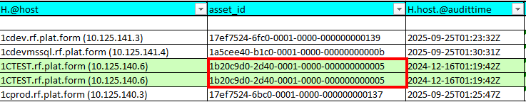
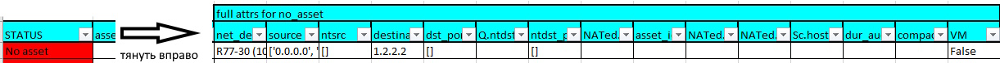
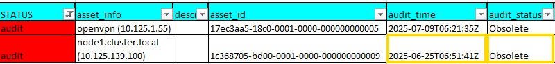
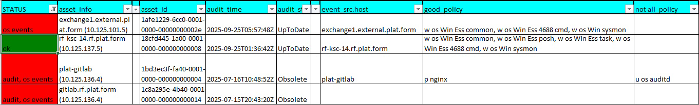
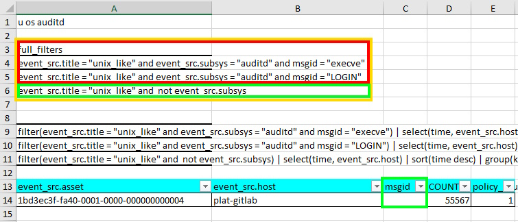

# 📊 Руководство по Excel отчетам

Данное руководство объясняет, как интерпретировать Excel файлы, генерируемые скриптом мониторинга источников событий MP.

## 📄 Структура отчета

### Страница "simple"
Страница **"simple"** представляет краткий свод состояния всех проверенных активов. В "идеальном мире" все строки в этой таблице должны быть зеленого цвета, что говорит о том, что все настроено идеально. 

В "реальном мире" эта страница содержит минимальную информацию, необходимую для того, чтобы подсветить активы с проблемами или правильно настроенные активы. 

Можно сказать, что это основной индикатор здоровья инфраструктуры мониторинга.

### Страница "FULL" 
Используется как выгрузка активов с результатами проверки политик.

Страница **"FULL"** представляет собой расширенный грид из Asset Manager:
- **Левая часть** — результат выполнения PDQL-запроса к активам
- **Правая часть** — колонки с результатами проверки политик (начиная с `event_src.host`)

**Особенности отображения:**
- Зеленая подсветка строк указывает на дублирование `asset_id`
- Для дублированных активов политики не перепроверяются (результаты копируются)
- Отображаются абсолютно все политики событий, которые проверялись

### Страницы политик
Необходимо для детального анализа конкретных политик.
Каждая страница именуется по названию политики сбора событий и используется для:
- Ручного анализа проблем, выявленных на странице "simple"
- Диагностики неполных политик из колонки "not_all_policy"

**Процесс анализа:**
1. Отфильтровать актив через колонку `event_src.asset`
2. Просмотреть имеющиеся события
3. Сравнить с ожидаемыми событиями (строка 3)
4. Выявить недостающие компоненты

## Статусы активов

### **OK**
Идеальное состояние актива:
- Аудит в порядке
- События ОС собираются корректно  
- Нет неполных политик в колонке "not_all_policy"

### **No asset**
Активы не найдены для указанных адресов.

Необходимо проверить колонку `Q.ntdst`. Все адреса в этой колонке транслируются из поля `destination`, для данных адресов не существует активов в MPX. Однако они доступны из сети интернет.

Поле `Q.ntdst` применимо только для NAT запросов. Для других запросов может быть другая колонка - например, для запросов AD_DC_* это будет поле `DnsHostName`.

### **Audit**
Указывает на проблемы со сканированием через Audit

**Возможные значения `audit_status`:**

| Статус | Описание |
|--------|----------|
| `NotDefined` | Не заданы политики проверки аудита актива, необходимо настроить: MPX → Система → Политики → Активы → Сроки актуальности |
| `NeverHappened` | Сканирование никогда не выполнялось |
| `NeedUpdate` | Данные вышли из срока актуальности. Требуется обновить результаты сканирования |
| `Obsolete` | Данные устарели, вероятно пересоздание актива после сканирования и появления дублей. Требуется проверить и пересоздать актив |
| `UpToDate` | Все отлично |

### **OS events**
Указывает на проблемы со сбором событий операционной системы.

Если поле `event_src.host` пустое, то события отсутствуют полностью. Если значения в колонке `not_all_policy` присутствуют - это означает, что какие-то политики не выполнены полностью, например не все msgid необходимые для политики.

**Требования по типам ОС:**

**Системы, отличные от Windows:**
- Минимум одна OS политика в `good_policy`

**Windows системы (обязательные политики):**
- `w os Win Ess common` — базовые события безопасности
- `w os Win Ess posh` — события PowerShell
- `w os Win Ess task` — события планировщика задач
- `w os Win sysmon` — события Sysmon
- `w os Win Ess 4688 cmd` — события запуска процессов с командной строкой

### **Audit, OS events**
Указывает на критическое состояние — проблемы и с аудитом, и со сбором событий.

## Пример на основе NAT PTLAB

### simple. status: No asset

Данные узлы не отображаются как активы, однако присутствуют в NAT-таблице, что указывает на их публикацию на периметре сети. Требуется проверить каждый адрес, указанный в колонке Q.ntdst.

### simple. status: audit

При статусе audit необходимо проанализировать поле "audit_status". В данном случае значение Obsolete указывает на то, что сканирование устарело. Требуется найти задачу аудита и проверить почему сканирвоание не происходит своевременно. Все статусы поля audit_time перечислены выше.

### simple. status: os events

#### rf-ksc-14.rf.plat.form (10.125.137.5)
Статус корректный: присутствуют события ОС windows.

#### gitlab.rf.plat.form (10.125.136.4)
нет событий

#### exchange1.external.plat.form (10.125.101.5)
для Windows OS необходимы логи всех укаханных "w os" политик в файле asset_filters, в нашем случае их 5 (w os Win Ess common, w os Win Ess posh, w os Win Ess task, w os Win Ess 4688 cmd, w os Win sysmon). 

политики w os Win Ess posh, w os Win Ess task не выполнены.

#### plat-gitlab (10.125.136.4)
Выявлена проблема: обнаружены события nginx, однако события ОС (u os auditd) присутствуют не полностью.

Для детального анализа необходимо скопировать asset_id и перейти на страницу политики u os auditd. Поскольку актив единственный, дополнительная фильтрация не требуется. 

Ожидаются желтые события, присутсвуют зеленые (unix_like без msgid), отсутствую красные: execve и LOGIN

##### Рекомендации по устранению
настроить сбор событий с узла plat-gitlab согласно https://doc.ptsecurity.com/ru-RU/projects/mp10/27.5/help/1766355339.